# Snort Network IDS Lab (Ubuntu 24.04)


I deployed Snort as a network intrusion detection system (NIDS) on an Ubuntu server, wrote four custom detection rules, and attacked the server from a Debian machine with ping, an Nmap SYN scan, hping3 and SSH.

**Result:** every attack produced alerts. All four custom rules fired, and Snort's built-in rules also caught traffic that my own rules missed.

> Part of my Linux and network security home lab series: Fail2Ban → **Snort** → Caldera → Metasploit.

---

## Contents

- [What Snort is and why it matters](#what-snort-is-and-why-it-matters)
- [Lab environment](#lab-environment)
- [How it works](#how-it-works)
- [Build steps](#build-steps)
- [Custom rules](#custom-rules)
- [Testing the rules](#testing-the-rules)
- [Results summary](#results-summary)
- [Command cheat sheet](#command-cheat-sheet)
- [Limitations](#limitations)
- [What I learned and would do differently](#what-i-learned-and-would-do-differently)
- [Skills demonstrated](#skills-demonstrated)

---

## What Snort is and why it matters

Snort is an open-source **network intrusion detection and prevention system**. It captures packets from a network interface, checks each one against a set of rules, and raises an alert when traffic matches a known bad pattern, such as a port scan or a connection to a sensitive service.

In this lab Snort runs in **IDS mode**: it watches and alerts, but does not block anything. Blocking (IPS mode) needs Snort to sit inline in the traffic path.

| | Snort | Fail2Ban |
|---|---|---|
| Scope | Network (packets on an interface) | Host (one server's logs) |
| Job | **Detect and alert** | **Prevent and respond** |
| Sees | Scans and probes, even with no login attempt | Only failures that a service logs |
| Output | Alert | Firewall ban |

Snort sees reconnaissance *before* an attacker gets to a login prompt. Fail2Ban acts once they start guessing passwords. Together they cover more of an attack than either one alone.

---

## Lab environment

Both machines are virtual machines in VMware Fusion, on the same NAT network (`192.168.79.0/24`).

| Role | System | IP |
|---|---|---|
| Snort sensor (and target) | Ubuntu Server 24.04.3 LTS (arm64) | `192.168.79.140` (`ens160`) |
| Attacker | Debian 13 | `192.168.79.141` |

| Software | Version |
|---|---|
| Snort | 2.9.20 |
| Nmap | 7.95 |
| hping3 | Debian package |

**Checking the network first.** I confirmed each machine's IP with `ip a` and checked they could reach each other with `ping` before installing anything.

**Why:** if the machines can't talk to each other, no test will produce alerts, and you can waste time blaming Snort for a network problem.

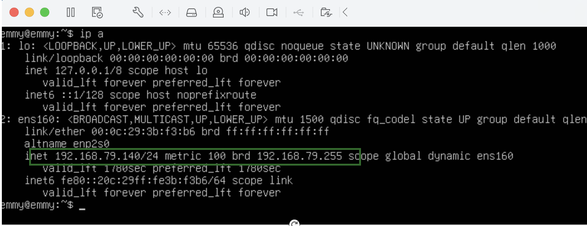

<details>
<summary>More screenshots: attacker IP and connectivity check</summary>

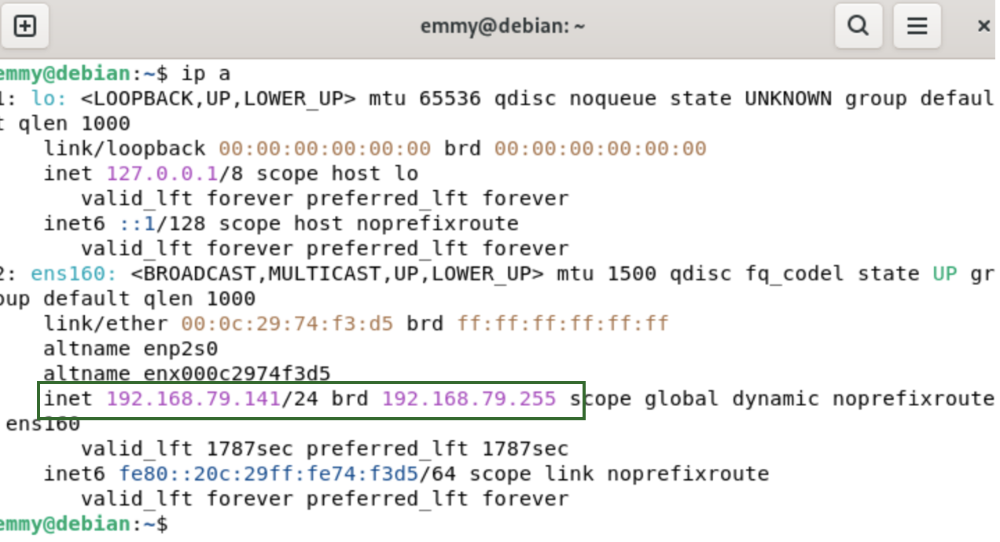
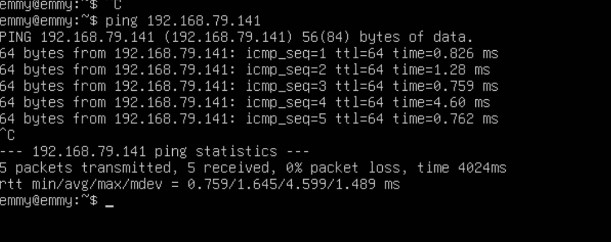

</details>

---

## How it works

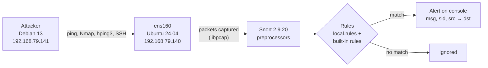
```mermaid
flowchart LR
    A["Attacker<br/>Debian 13<br/>192.168.79.141"] -- "ping, Nmap, hping3, SSH" --> B["ens160<br/>Ubuntu 24.04<br/>192.168.79.140"]
    B -- "packets captured<br/>(libpcap)" --> C["Snort 2.9.20<br/>preprocessors"]
    C --> D{"Rules<br/>local.rules +<br/>built-in rules"}
    D -- "match" --> E["Alert on console<br/>msg, sid, src → dst"]
    D -- "no match" --> F["Ignored"]
```

1. Snort captures every packet arriving on the interface.
2. **Preprocessors** clean up and reassemble traffic (for example, rebuilding TCP streams) so rules see what the application sees.
3. Each packet is checked against the **rules**. A rule says what to look for (protocol, addresses, ports, TCP flags, rate) and what message to raise.
4. A match produces an **alert** with the rule's message, its ID (`sid`) and the source and destination.

---

## Build steps

### 1. Update package lists

```bash
sudo apt update
```

**Why:** so `apt` installs the current version of Snort and its dependencies, including security fixes.

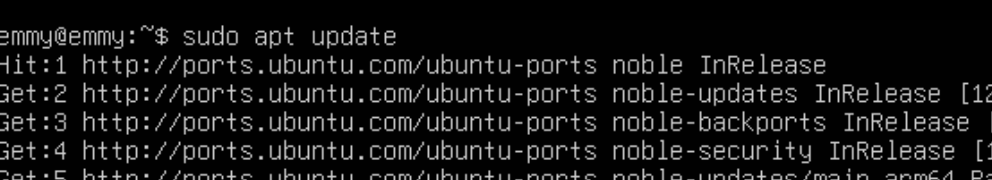

### 2. Fix an interrupted package install

My first `sudo apt install snort` failed:

```text
E: dpkg was interrupted, you must manually run 'sudo dpkg --configure -a' to correct the problem.
```

```bash
sudo dpkg --configure -a
```

**Why:** an earlier install or update had been stopped halfway through, leaving packages unconfigured. `dpkg --configure -a` finishes configuring everything that was left pending, which unlocks `apt` again.

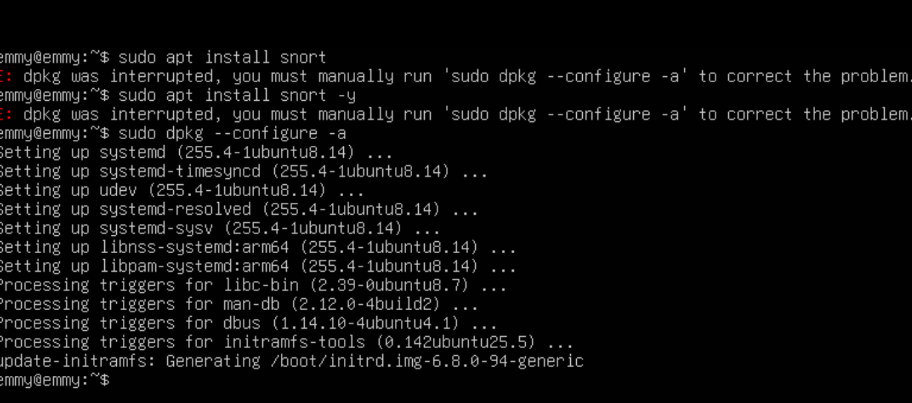

### 3. Install Snort and set HOME_NET

```bash
sudo apt install snort -y
```

During the install, Ubuntu asks for the **address range of the local network**. The default was `192.168.0.0/16`, and I changed it to `192.168.79.0/24`.

**Why:** `HOME_NET` tells Snort which addresses it is protecting. Many rules only fire for traffic going *into* `HOME_NET`, so it has to match your real subnet. A `/16` would cover 65,536 addresses when the lab only uses 256.

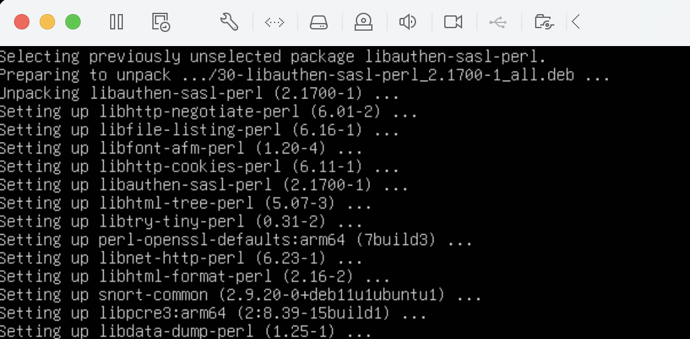
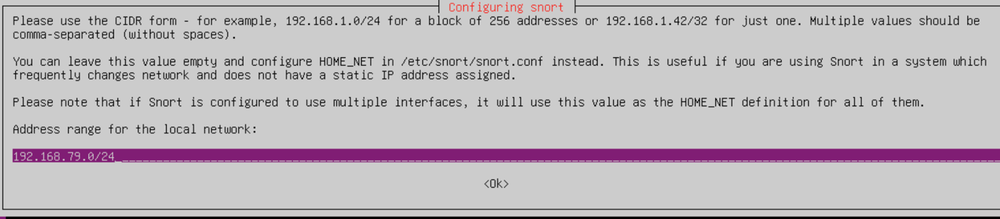

<details>
<summary>More screenshots: default HOME_NET prompt and version check</summary>

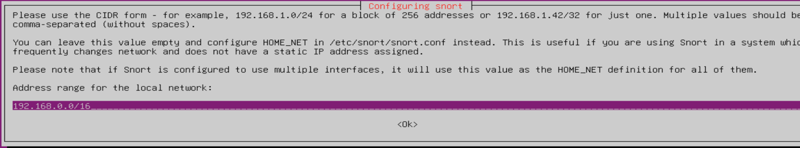
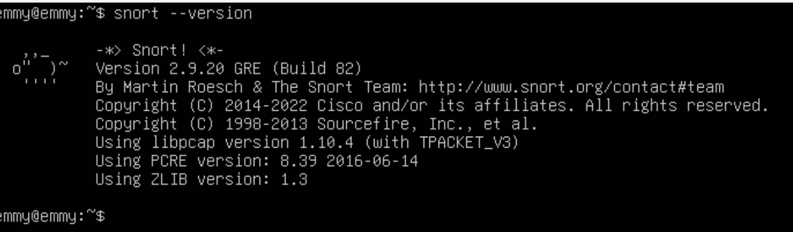

</details>

```bash
snort --version     # Version 2.9.20 GRE (Build 82)
```

### 4. Confirm HOME_NET in snort.conf

```bash
sudo nano /etc/snort/snort.conf
```

```text
ipvar HOME_NET 192.168.79.0/24
ipvar EXTERNAL_NET any
```

**Why:** the install prompt sets `HOME_NET` for the Snort service (in `/etc/snort/snort.debian.conf`), but when you run Snort by hand with `-c /etc/snort/snort.conf`, the value in `snort.conf` is the one used. Both need to match the real subnet. `EXTERNAL_NET` stays `any` because the attacker is inside the same subnet.

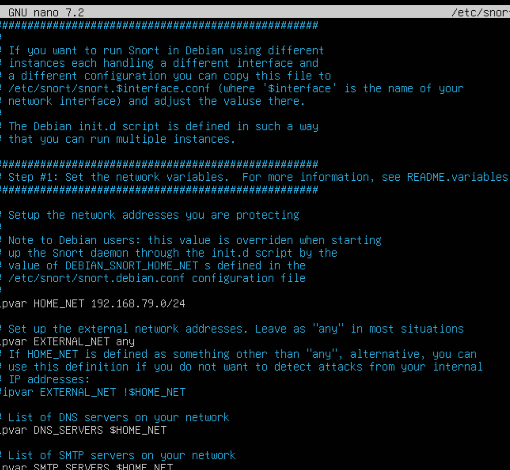

---

## Custom rules

I added four rules to `/etc/snort/rules/local.rules`, the file reserved for your own rules. It starts empty.

```text
# Rule 1 - Detect ICMP traffic
alert icmp any any -> any any (msg:"ICMP Packet Detected"; sid:1000001; rev:1;)

# Rule 2 - Detect Nmap SYN scan
alert tcp any any -> any any (msg:"Nmap SYN Scan Detected"; flags:S; threshold:type threshold, track by_src, count 20, seconds 3; sid:1000002; rev:1;)

# Rule 3 - Detect hping3 traffic
alert tcp any any -> any any (msg:"hping3 Traffic Detected"; flags:S; threshold:type threshold, track by_src, count 15, seconds 2; sid:1000003; rev:1;)

# Rule 4 - Custom SSH rule (TCP to port 22)
alert tcp any any -> $HOME_NET 22 (msg:"TCP Connection Attempt on SSH Port"; sid:1000004; rev:1;)
```

### How to read a rule

`alert tcp any any -> $HOME_NET 22 (msg:"..."; sid:1000004; rev:1;)`

| Part | Meaning |
|---|---|
| `alert` | Action: raise an alert |
| `tcp` | Protocol to match |
| `any any` | Source address and port |
| `->` | Direction |
| `$HOME_NET 22` | Destination address and port |
| `msg` | Text shown in the alert |
| `flags:S` | Only packets with just the SYN flag set, the first packet of a TCP connection |
| `threshold` | Only alert after `count` matches from one source within `seconds` |
| `sid` | Unique rule ID. Custom rules use 1,000,000 and above so they never clash with official rules |
| `rev` | Revision number, increased each time you edit the rule |

### Why each rule

- **Rule 1 (ICMP):** catches ping sweeps, which are usually the first thing an attacker does to find live hosts.
- **Rules 2 and 3 (SYN floods and scans):** a SYN scan sends one SYN to many ports very quickly. A single SYN is normal, since every TCP connection starts with one, so the rules use a **threshold** and only alert when one source sends many SYNs in a short time. This cuts false positives.
- **Rule 4 (SSH):** SSH is a high-value target, so any TCP traffic to port 22 on the protected network raises an alert.

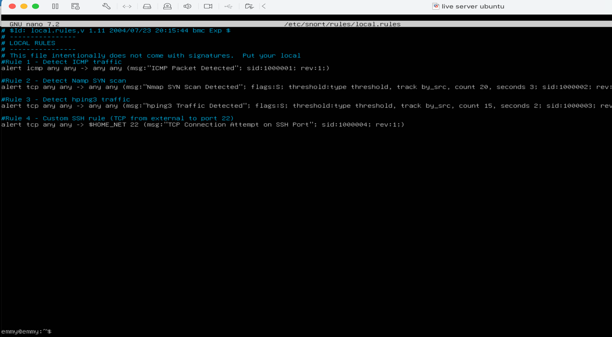

<details>
<summary>More screenshots: empty local.rules and first draft</summary>

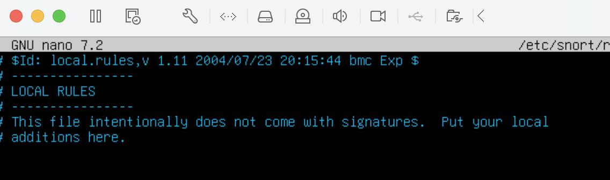
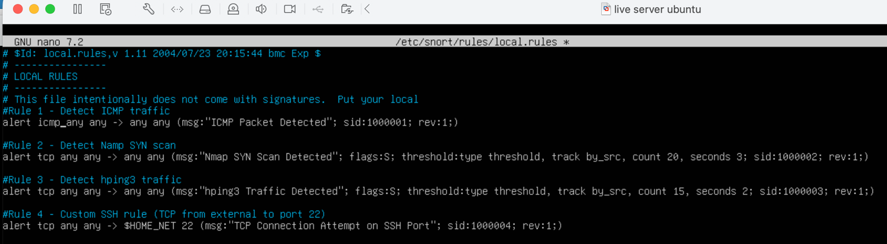

</details>

My first draft had a typo in Rule 1 (`icmp_any` instead of `icmp any`), which I fixed before validating the configuration.

### Validate the configuration

```bash
sudo snort -T -c /etc/snort/snort.conf
```

```text
Snort successfully validated the configuration!
```

**Why:** `-T` is test mode. Snort loads the config and every rule, reports errors, then exits. Always run it after editing rules: a single syntax error stops Snort from starting at all.

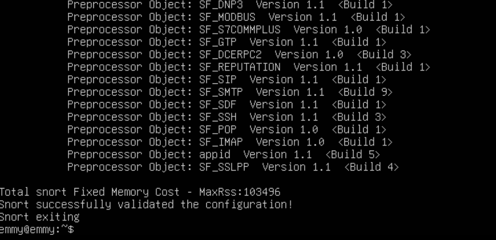

### Start Snort

```bash
sudo snort -A console -q -i ens160 -c /etc/snort/snort.conf
```

| Option | Meaning |
|---|---|
| `-A console` | Print alerts to the terminal |
| `-q` | Quiet: hide the startup banner and statistics |
| `-i ens160` | Interface to listen on |
| `-c` | Config file to load |

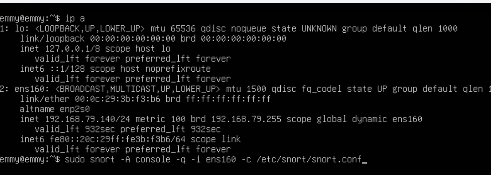

Alerts started straight away, before I had sent any traffic. They were **IPv6 neighbour discovery and multicast packets** (`ff02::2`, `ff02::16`) that every Linux machine sends normally. Rule 1 matches them because it covers all ICMP, including ICMPv6. Snort's built-in `BAD-TRAFFIC same SRC/DST` rule also fired on DHCP and IPv6 packets with an unspecified source address.

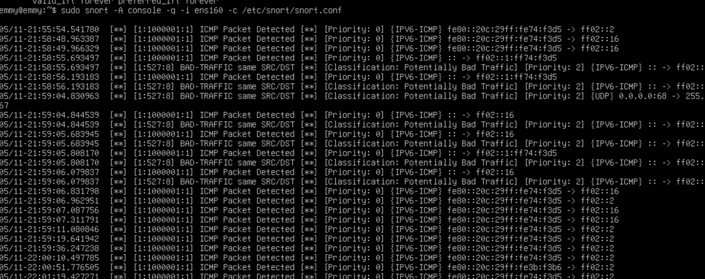

This is a real lesson in tuning: a rule as broad as Rule 1 creates noise from normal network housekeeping.

---

## Testing the rules

All attacks were run from the Debian machine (`192.168.79.141`) against the Ubuntu sensor (`192.168.79.140`).

### Test 1: ICMP (ping)

```bash
ping 192.168.79.140
```

**Rule 1 fired** for every packet, in both directions: echo requests `.141 → .140` and replies `.140 → .141`. 90 packets were sent and received with no loss.

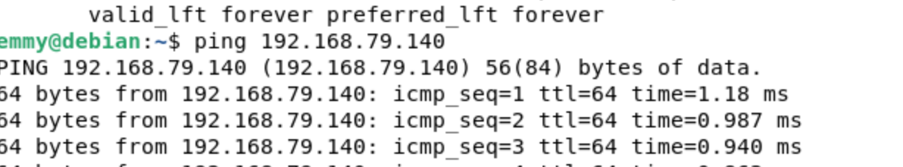
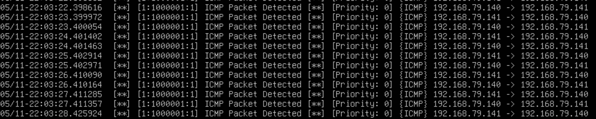

<details>
<summary>More screenshots: further ICMP alerts and ping statistics</summary>

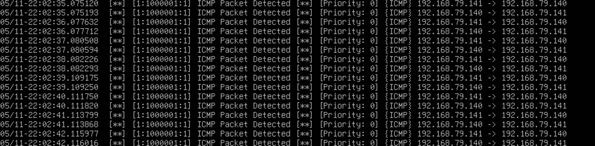
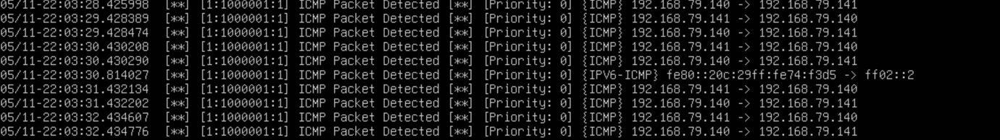
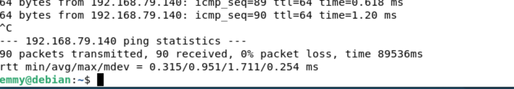

</details>

### Test 2: Nmap SYN scan

Getting the scan to run took two fixes:

1. `nmap: command not found`, because Nmap wasn't installed, so I ran `sudo apt install nmap`.
2. `You requested a scan type which requires root privileges`, because a SYN scan (`-sS`) builds raw packets, which needs root. I reran it with `sudo`.

```bash
sudo nmap -sS 192.168.79.140
```

Nmap found **22/tcp open (ssh)**, with the other 999 ports closed, in 0.22 seconds.

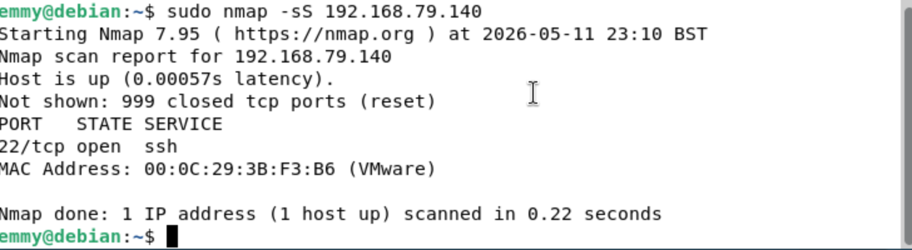

**Rules 2 and 3 both fired.** Nmap sent SYNs to hundreds of ports from one source port (`51211`) in a fraction of a second, far over both thresholds.

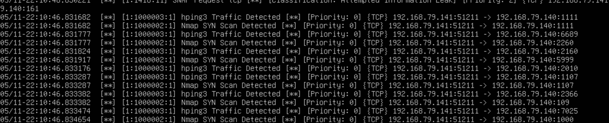

<details>
<summary>More screenshots: Nmap troubleshooting and further alerts</summary>


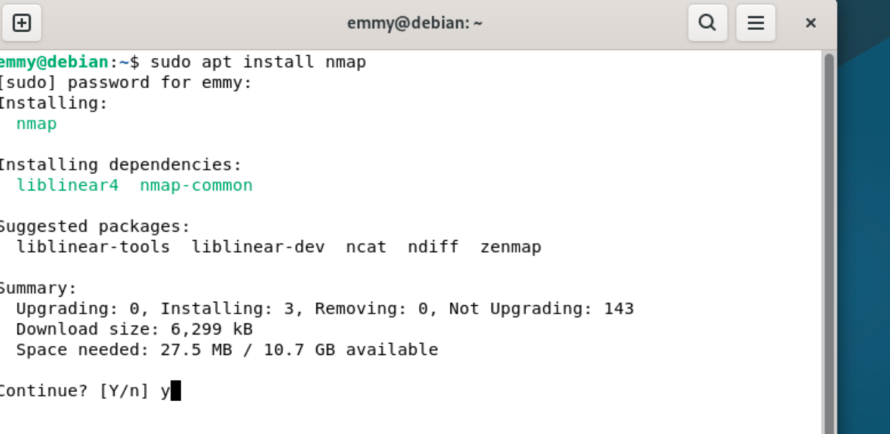

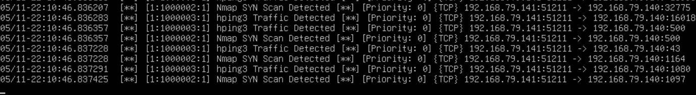

</details>

### Test 3: hping3 SYN packets

```bash
sudo apt install hping3
sudo hping3 -S 192.168.79.140
```

hping3 sent 77 SYN packets and every one got a reset back (`flags=RA`).

**Rule 3 did not fire here.** By default hping3 sends **one packet per second**, which never reaches Rule 3's threshold of 15 packets in 2 seconds. Instead, Snort's **built-in rule `sid 524` (`BAD-TRAFFIC tcp port 0 traffic`)** caught it, because hping3 sends to port 0 by default, which legitimate traffic never uses.

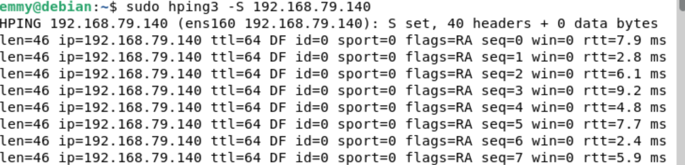
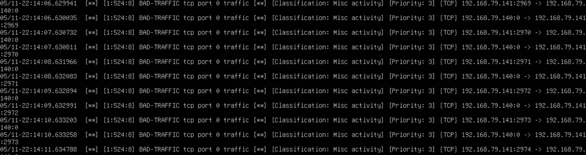

<details>
<summary>More screenshots: installing hping3 and its statistics</summary>

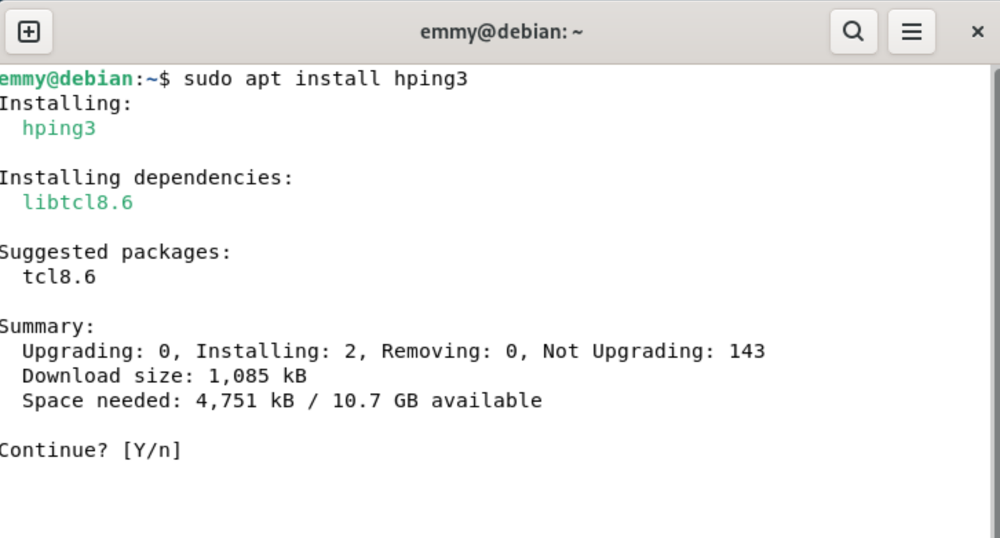
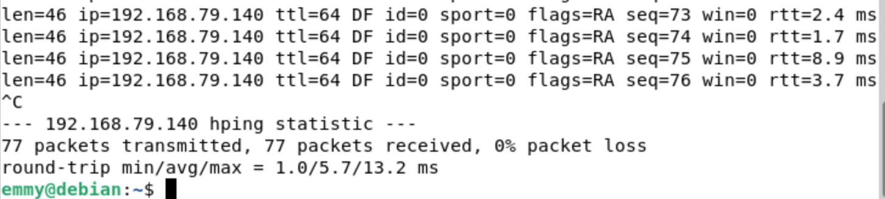

</details>

### Test 4: SSH connection

```bash
ssh emmy@192.168.79.140
```

**Rule 4 fired** as soon as the connection started, and kept firing: the login succeeded, and every packet of the session raised another alert, all from the same source port (`57082`).

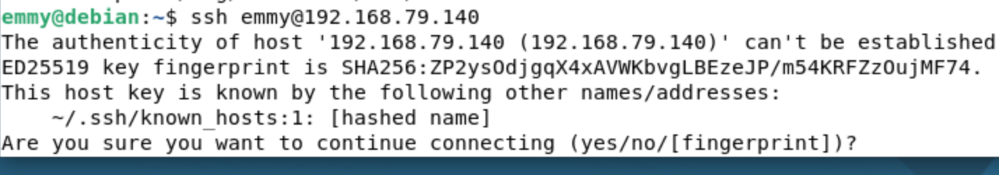
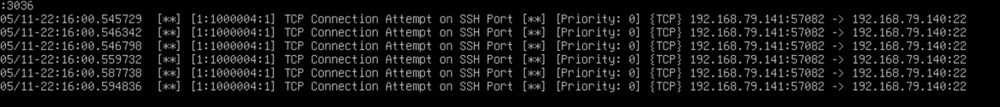
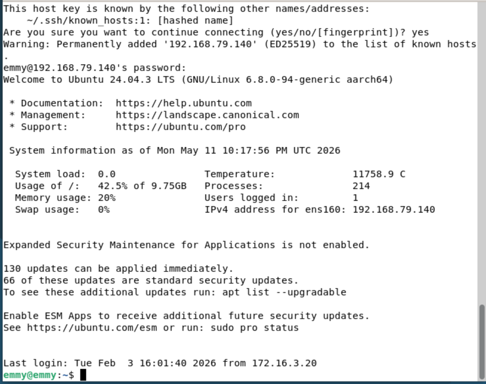

<details>
<summary>More screenshots: password prompt and alerts during the session</summary>

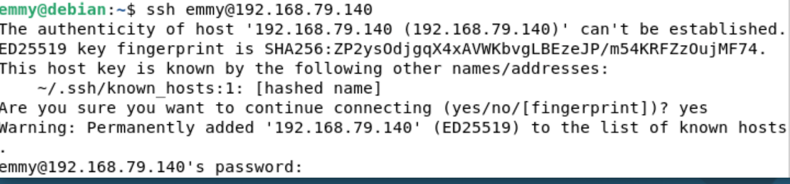
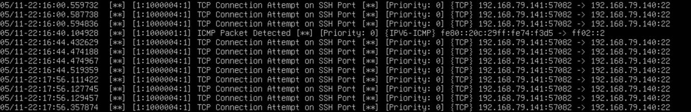
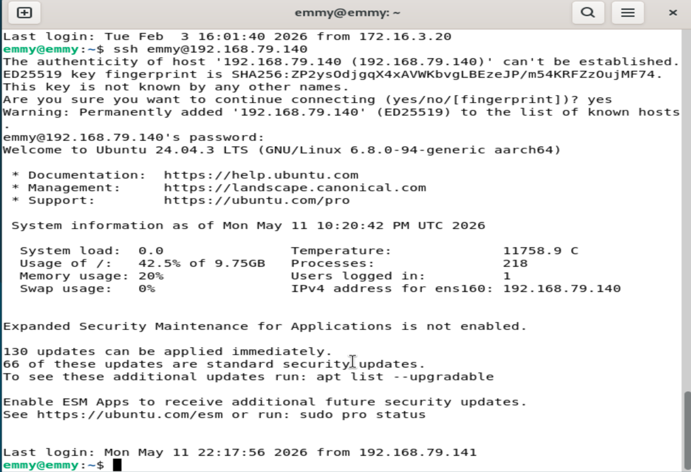
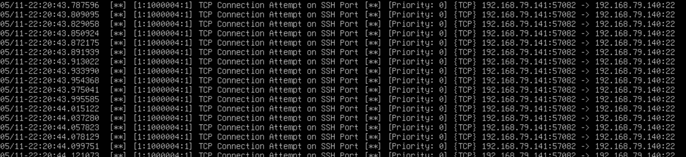

</details>

---

## Results summary

| Test | Command | What fired | Notes |
|---|---|---|---|
| ICMP | `ping` | Rule 1 (`sid 1000001`) | Both directions, plus IPv6 background noise |
| SYN scan | `sudo nmap -sS` | Rules 2 and 3 (`sid 1000002`, `1000003`) | Both rules match the same scan |
| hping3 | `sudo hping3 -S` | Built-in `sid 524` (port 0) | Too slow for Rule 3's threshold |
| SSH | `ssh` | Rule 4 (`sid 1000004`) | One alert per packet, not per connection |

The final rules are in [`config/local.rules`](config/local.rules).

---

## Command cheat sheet

```bash
# Interfaces and connectivity
ip a
ping <ip>

# Fix a broken package install
sudo dpkg --configure -a

# Snort
snort --version
sudo snort -T -c /etc/snort/snort.conf                    # test config and rules
sudo snort -A console -q -i ens160 -c /etc/snort/snort.conf   # run with console alerts
sudo nano /etc/snort/rules/local.rules                    # custom rules

# Traffic generation (attacker)
sudo nmap -sS <ip>         # SYN scan
sudo hping3 -S <ip>        # SYN packets, 1 per second
sudo hping3 -S --flood <ip>   # SYN packets as fast as possible
ssh user@<ip>
```

---

## Limitations

- **Detection only:** in IDS mode Snort alerts but does not block. An attacker who is spotted can still carry on unless something else, such as a firewall or Fail2Ban, acts on the alert.
- **Signature-based:** Snort only catches what a rule describes. A new technique with no matching rule goes unnoticed.
- **Blind to encrypted payloads:** Snort can see that an SSH or HTTPS connection happened, but not what was sent inside it.
- **Tuning is essential:** broad rules like Rule 1 bury real attacks in noise. Every rule needs to be narrow enough to be useful.
- **Single-host view:** here the sensor was also the target, so it only saw its own traffic. To watch a whole network, a sensor needs a mirror (SPAN) port or network tap.

---

## What I learned and would do differently

- **Rules 2 and 3 can't tell Nmap from hping3.** They are the same rule with different thresholds (any source sending SYNs quickly), so a single Nmap scan triggered both. Telling the tools apart needs something that actually differs between them, such as TCP window size or TCP options. Otherwise it is cleaner to have one "SYN scan" rule and let the built-in port 0 rule catch default hping3.
- **Test at realistic rates.** Default hping3 (one packet per second) never reached Rule 3's threshold. `hping3 -S --flood` would have tested the rule properly.
- **Rule 4 is too noisy.** It matches every packet to port 22, so one SSH session raised dozens of alerts. Adding `flags:S;` would alert once per new connection.
- **Rule 1 catches normal IPv6 housekeeping.** Limiting it to IPv4 echo requests going into `HOME_NET` (`itype:8`) removes the neighbour-discovery noise.
- **Built-in rules matter.** Snort's own rule set caught the port 0 probes that my custom rules missed. Custom rules should add to the community rules, not replace them.
- **`threshold` inside rules is the older syntax.** Snort 2.9 prefers `event_filter` in `threshold.conf`.

**Next iteration (not yet tested):**

```text
# IPv4 echo requests into the protected network only
alert icmp $EXTERNAL_NET any -> $HOME_NET any (msg:"ICMP Echo Request to HOME_NET"; itype:8; sid:1000001; rev:2;)

# One SYN scan rule instead of two overlapping ones
alert tcp $EXTERNAL_NET any -> $HOME_NET any (msg:"Possible SYN Port Scan"; flags:S; threshold:type both, track by_src, count 20, seconds 3; sid:1000002; rev:2;)

# One alert per new SSH connection, not per packet
alert tcp $EXTERNAL_NET any -> $HOME_NET 22 (msg:"New SSH Connection Attempt"; flags:S; sid:1000004; rev:2;)
```

Further ideas: send alerts to a file or SIEM instead of the console, run Snort as a `systemd` service so it starts on boot, and try IPS (inline) mode so matching traffic is dropped, not just reported.

---

## Skills demonstrated

- Linux server setup on Ubuntu 24.04 (`apt`, `dpkg` recovery, config files)
- Network troubleshooting (`ip a`, `ping`, interfaces, subnets and CIDR)
- TCP/IP fundamentals: the TCP handshake, SYN and RST flags, ICMP, ports
- IDS deployment, configuration validation and rule writing
- Attack simulation with Nmap and hping3
- Alert analysis: separating real attacks from background noise
- Honest evaluation of detection coverage and rule tuning
- Technical documentation

---

*Author: Emmanuel Aliu · MSc Cloud and Network Security, University of Greater Manchester*
